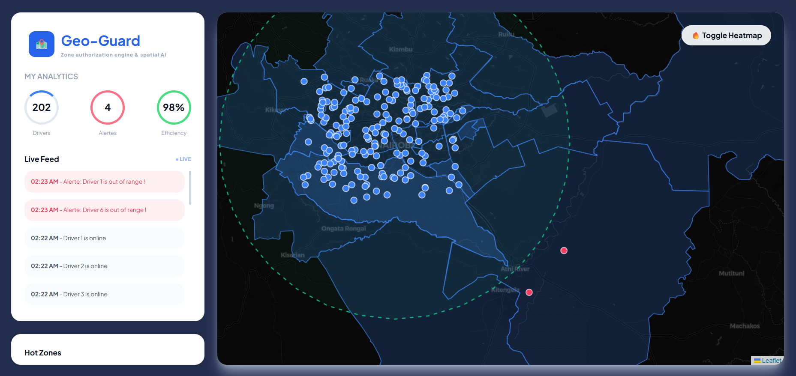
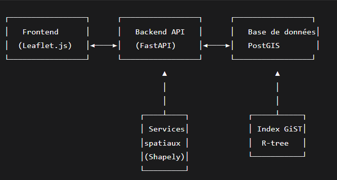
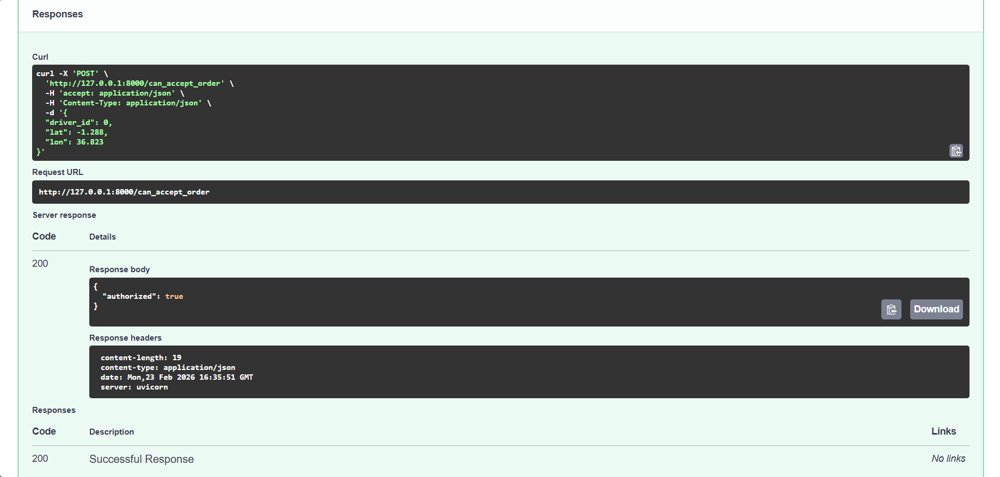

# Geo-Guard (Zone authorization engine & spatial AI)


**Real-time delivery eligibility verification engine**  
I developed Geo-Guard to solve a critical last-mile problem: geographic compliance.

This is not just a map, it is a decision engine that processes thousands of positions per second. I used PostGIS for heavy spatial calculations, FastAPI for performance, and I integrated a dynamic Heatmap to allow managers to see at a glance where the fleet is concentrated. The contextualization on Nairobi proves that the system is ready for real-world deployment.

---

## 🖥️ Preview


##  Features

- **API REST** developed with **FastAPI** for quick checks.
- **Space engine** using **PostGIS** and **Shapely** for geometric calculations (point in polygon).
- **GiST Spatial Indexing** for efficient queries on large volumes of data.
- **Dynamic zone management** : filtering by schedule, weather conditions, congestion level.
- **Mass simulation** : insertion and questioning of 100,000 delivery people.
- **Machine Learning** :
- Clustering orders with **DBSCAN** to identify high-demand areas. 
- Anomaly detection (couriers outside the zone). 
- **Interactive map** with **Leaflet.js** to visualize authorized areas and couriers' positions in real time. 
- **Nairobi contextualization**: data from OpenStreetMap to represent real neighborhoods (CBD, Westlands, Karen).

### Spatial AI & Visualization
- **Real-time Glassmorphism Dashboard:** A high-contrast dark-themed interface for 24/7 monitoring centers.
- **Dynamic Heatmap Layer:** Real-time aggregation of driver density using Leaflet.heat to identify logistical hotspots.
- **Automated Event Feed:** A live scrolling notification system that triggers alerts when geofencing boundaries are breached.
- **Geodesic Geofencing:** Use of ST_Buffer on Geography types to create a precise 25km safety radius around Nairobi, avoiding the distortion issues of standard geometry.
---

##  Architecture




### Technical Stack
- **Backend**: Python 3.9+, FastAPI, SQLAlchemy, GeoAlchemy2, Shapely, GeoPandas
- **Database**: PostgreSQL + PostGIS, GiST index
- **ML / Data**: scikit-learn (DBSCAN), NumPy
- **Frontend**: HTML, JavaScript, Leaflet.js, Mapbox (optional)
- **Deployment**: Docker, Docker Compose

---

## Installation

### Prerequisites
- Python 3.9+
- PostgreSQL with PostGIS (or Docker)
- Git


### 1. Clone the repository
```bash
git clone https://github.com/votre-compte/delivery-zone-engine.git
cd delivery-zone-engine
```
### 2. Launch with Docker (recommended)

```bash
docker-compose up -d
```
The database will be accessible on localhost:5432 (user postgres, password postgres, database delivery_zones).

### 3. Manual installation (without Docker)

- Create a PostgreSQL database and enable the PostGIS extension.

- Edit app/database.py with your credentials.

### 4. Virtual environment and dependencies

```bash
python -m venv venv
source venv/bin/activate  # ou venv\Scripts\activate sous Windows
pip install -r requirements.txt
```

### 5. Initialize the database
```bash
python scripts/init_db.py
python scripts/insert_zones.py   # insertion de zones exemple (Nairobi)
```

### 6. Launch the API
```bash
uvicorn app.main:app --reload
```

The API is accessible at http://localhost:8000. The interactive Swagger documentation is available at http://localhost:8000/docs.

### 7. (Optional) Simulate 100,000 delivery people
```bash
python scripts/simulate_drivers.py
```

### 8. View the map

Open http://localhost:8000/static/index.html to display the interactive map.

## Use of the API

**Main endpoint:** POST /can_accept_order
Checks if a delivery person can accept an order at a given location.

**Request body (JSON):**
```json
{
  "driver_id": 12,
  "lat": -1.2921,
  "lon": 36.8219,
  "current_time": "2025-03-01T14:30:00Z",   
  "weather": "rain",                          
  "congestion_tolerance": 3                    
}
```

**Answer:**
```json
{
  "authorized": true
}
```


**Other endpoints**

- GET /zones/geojson: returns all zones in GeoJSON format for display on a map.

- GET /drivers/anomalies: lists drivers whose last position is out of zone.

- GET /clustering/orders: performs a DBSCAN clustering on orders (to be implemented according to your data).

## Exemples de requêtes

**Simple verification**
```bash
curl -X POST "http://localhost:8000/can_accept_order" \
  -H "Content-Type: application/json" \
  -d '{"driver_id": 42, "lat": -1.2921, "lon": 36.8219}'
```
**With time filters**
```bash
curl -X POST "http://localhost:8000/can_accept_order" \
  -H "Content-Type: application/json" \
  -d '{"driver_id": 42, "lat": -1.2921, "lon": 36.8219, "current_time": "2025-03-01T23:00:00Z"}'
```

## Advanced Features (Version 3)

### Order Clustering
The endpoint /clustering/orders?eps=0.01&min_samples=5 applies the DBSCAN algorithm to the positions of recorded orders. The resulting clusters can be used to optimize the placement of delivery drivers or to generate heatmaps.

### Anomaly Detection
The system continuously monitors the positions of delivery drivers and identifies those who are outside authorized areas. These anomalies are accessible via /drivers/anomalies.

### Dynamic Zones

Each zone can be associated with:

- **A validity period** (e.g., delivery only from 8 AM to 8 PM)

- **A weather condition** (e.g., zone closed in case of rain)

- **A maximum accepted congestion level**

These criteria are evaluated during the can_accept_order request if the corresponding parameters are provided


## Contextualization Nairobi

The project has been enriched with real data from the city of Nairobi:

- **Neighborhoods:** approximate polygons of the CBD, Westlands, Karen.

- **Simulation:** the positions of delivery people and orders are generated within the city's boundaries.

- **OpenStreetMap Data:** possibility to import precise administrative boundaries via osmnx.

- **OSM Integration:** Automated neighborhood extraction (Westlands, Embakasi, Kasarani, etc.) using OpenStreetMap administrative levels via osmnx.

This approach makes the project realistic and relevant for applications in the Kenyan context (urban logistics, meal delivery, e-commerce).


## Performance and Scalability

- **GiST index** on geometric columns (zones.geom, drivers.last_position) for fast spatial searches

- **Optimized queries:** use of ST_Contains with index

- **Load testing:** tested with 100,000 couriers and millions of simulated orders without significant performance degradation

- **Modular architecture** allowing easy addition of new features (Redis cache, load balancing, etc.)


## Key Technical Challenges & Solutions

### 1. High-Performance Spatial Lookups

- **Challenge:** Checking order eligibility for 100,000+ drivers in real-time without bottlenecking the API.
- **Solution:** Implemented GiST (Generalized Search Tree) indexing on geometric columns. This reduced query complexity from $O(N)$ to $O(log N)$, allowing the engine to process thousands of coordinate checks per second with sub-millisecond latency.

### 2. Geodesic Accuracy vs. Planar Geometry

- **Challenge:** Standard Euclidean calculations (flat map) lead to significant errors when calculating large delivery radii (like the 25km Nairobi Super-Zone).
- **Solution:** Utilized PostGIS Geography types and ST_Buffer for the "Super Zone". This ensures calculations account for the Earth's curvature, providing professional-grade precision for logistics.

### 3. Real-time Data Visualization (The "Noise" Problem)

- **Challenge:** Displaying thousands of moving markers on a web map often causes browser lag and visual clutter.
- **Solution:**
    - Developed a Dynamic Heatmap layer to aggregate driver density instead of just showing individual points.
    - Implemented an **Anomaly-only logging system** that highlights critical events (geofence breaches) while keeping the UI clean and responsive through a "Glassmorphism" interface.

### 4. Handling Inconsistent OpenStreetMap Data

- **Challenge:** Real-world data from OSM often contains missing attributes (like null names) or complex geometries that crash standard database inserts.

- **Solution:** Built a robust ETL (Extract, Transform, Load) script using osmnx and Shapely. The script performs automated geometry cleaning and handles "NaN" values during the migration to PostGIS, ensuring data integrity.


##  Project structure


## Highlighted Skills

This project demonstrates my mastery of the following areas:

- **Geospatial Engineering:** handling geometric data, spatial queries, indexing.

- **Backend Development:** REST API with FastAPI, database integration, performance optimization.

- **Spatial Databases:** PostgreSQL/PostGIS, GeoAlchemy2, designing suitable schemas.

- **Data Analysis and Machine Learning:** clustering (DBSCAN), anomaly detection, visualization.

- **Map Visualization:** Leaflet.js, GeoJSON data integration.

- **Scalability:** load simulation, managing large volumes of data.

- **Field Contextualization:** adaptation to a real use case (Nairobi)


## License
This project is under the MIT license. See the LICENSE file for more details.

## 👤 Author

Francky Shakespeare GBANDI Geospacial Data scientist

- 📧 frankyshakespeare@gmail.com

Feel free to contact me for any questions, suggestions, or professional opportunities!